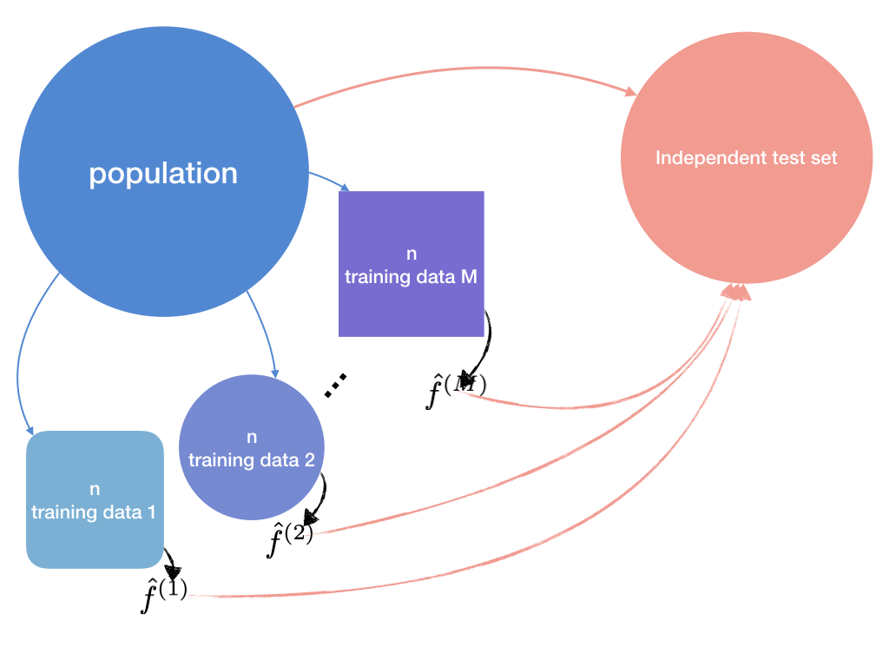

```{r setup, include=FALSE}
knitr::opts_chunk$set(
  comment = "#>",
  collapse = TRUE,
  out.width = "70%",
  fig.align = "center",
  fig.pos = "H",
  fig.width = 6,
  fig.asp = .618
  )
knitr::knit_hooks$set(
  document = function(x) {
    sub("\\usepackage[]{color}", "\\usepackage{xcolor}", x, fixed = TRUE)
  }
)
options(digits = 3)
options(kableExtra.latex.load_packages = FALSE)
pander::panderOptions("digits", 3)
is_latex <- knitr::opts_knit$get("rmarkdown.pandoc.to") == "latex"
is_beamer <- knitr::opts_knit$get("rmarkdown.pandoc.to") == "beamer"
printcode <- params$printcode
```

```{r, message=FALSE, echo=FALSE}
# tidyverse family---------------------
library(tidyverse)
# large data--------------------------
library(data.table)
# parallel replication----------------
library(foreach)
# custom packages----------------------
library(rmdtool) # devtools::install_github("ygeunkim/rmdtool")
library(goodgraphic) # devtools::install_github("ygeunkim/goodgraphic")
# set seed for report -----------------
set.seed(1)
```

```{r, message=FALSE, echo=FALSE}
# devtools::install_github("ygeunkim/ceshat")
library(ceshat)
# devtools::install_github("ygeunkim/youngtool")
library(youngtool)
# GARCH
library(fGarch)
library(rugarch)
```

# Introduction

## Concepts of Financial Risk

Consider any loss distribution. See Figure \@ref(fig:lossdist). This is the probability distribution of given time horizon. Value at risk (VaR) is the quantile for the right tail probability.

```{r lossdist, echo=FALSE, fig.cap="Loss Distribution - Can the financial institution still be in business after a catastrophic event?"}
tibble(
  x = seq(-3, 3, by = .01),
  y = dnorm(x),
  VaR = x >= qnorm(.05)
) %>% 
  ggplot(aes(x = x)) +
  geom_path(aes(y = y)) +
  geom_ribbon(aes(ymin = 0, ymax = y, fill = VaR), show.legend = FALSE, alpha = .7) +
  scale_fill_manual(values = c("TRUE" = gg_hcl(1), "FALSE" = NA)) +
  theme_minimal() +
  theme(
    text = element_blank(),
    axis.ticks = element_blank()
  )
```

Why do economists care about this kind of measure? Both financial institutions and the regulatory committee should analyze the risk of their impressive portfolio. @Tsay:2010aa interprets this in the two viewpoint. For financial institutions, VaR can be read as a maximal loss of a financial position during a given time horizon for a given probability. It leads to meaning the measure of loss under normal market conditions. For the regulatory committee, on the other hand, it can be read as a minimal loss under extraordinary market circumstances.

As we can see in Figure \@ref(fig:lossdist), VaR is defined using the probability distribution of loss. Let $p$ be the right tail probability, the red area in the figure. Let $l$ be the time horizon, let $L(l)$ be the loss function of the asset from $t$ to $t + l$, and let $F_l$ be the CDF of $L(l)$. Then

\begin{equation}
  p = P \left[ L(l) \ge VaR \right]
  (\#eq:vardef)
\end{equation}

```{r lossquantile, echo=FALSE, fig.cap="CDF of Loss"}
tibble(
  x = seq(-3, 3, by = .01),
  y = pnorm(x),
  quant = y >= .05
) %>% 
  ggplot(aes(x, y, colour = quant)) +
  geom_line(show.legend = FALSE) +
  scale_colour_manual(values = c("TRUE" = gg_hcl(1), "FALSE" = "black")) +
  scale_y_continuous(breaks = c(0, .05, 1)) +
  theme_minimal() +
  theme(
    axis.text.x = element_blank(),
    axis.title = element_blank()
  )
```

See Figure \@ref(fig:lossquantile). VaR can be computed by finding the $p$-th quantile.

\begin{equation}
  VaR = \inf \left\{ x \mathpunct{:} F_l(x) \ge 1 - p \right\}
  (\#eq:varquant)
\end{equation}

## Calculating VaR

There are many ways to get VaR in a parametric way. Equation \@ref(eq:varquant) shows that VaR is the quantile in each time horizon. It is natural to employ quantile regression to get this quantile value.


This report consists of three parts. In Section \@ref(background), we covered basic concepts about CVaR and CES. In Section \@ref(nonparam), I reviewed the paper [@cai:2008aa] briefly. Theoretical parts were mostly skipped. In Section \@ref(experiment), we applied the method in both simulation settings and real data.


# Background {#background}

## Expected Shortfall

Many authors only cover the value-at-risk or expected shortfall in their papers. Value at risk is famous, and its concept is simple. In the market, two portfolios can be merged, sometimes. When this happens, the risk measure should not be higher than the sum of each, which is called the subadditivity. VaR does not satisfy this property, so it can underestimate the actual loss. The expected shortfall as the other risk measure, however,  satisfies the condition. The expected shortfall is defined by the expected value of loss function if the VaR is exceeded.

\begin{equation}
  ES \defn E \left[ L(l) \mid L(l) \ge VaR \right]
  (\#eq:esdef)
\end{equation}

In other words, while VaR cares about the maximal loss in the right tail probability part, saying $0.95$, ES cares average loss in the remaining part, $0.05$.

## Return

We prefer to use log return data. Let $\{ P_t \}$ be the price series. Then the log return is defined by $\{ Y_t \defn \ln \frac{P_t}{P_{t - 1}} \}$. Loss occurs when the return $\{ P_t - P_{t - 1} \}$ are negative, so we should use the negative returns or negative log returns.

Consider Taylor expansion for this log function. For any $x_0 > 0$,

\begin{equation}
  \ln x \approx \ln x_0 + \frac{1}{x_0}(x - x_0)
\end{equation}

Write $x = x_2$, $x_0 = x_1$. Then

\begin{equation}
  \ln \frac{x_2}{x_1} \approx \frac{x_2}{x_1} - 1 = \frac{x_2 - x_1}{x_1}
  (\#eq:logpercent)
\end{equation}

Observe that the log return approximates to the change rate. @cai:2008aa used the following value in a real example part.

$$-100 Y_{t + 1} = -100 \ln \frac{P_{t + 1}}{P_t}$$

which approximates to percentage loss.

## Conditional Information

In econometrics, conditional information is always the researchers' interests. For example, we are interested in the exogenous variables like economic or market variables. When we look at return data, we can condition past observed returns.

Let $\{ Y_t \}$ be stationary log returns and let $\{ X_t \}$ be conditional information series.

```{definition, condvar, name = "Conditional Value-at-Risk"}
Let $F(y \mid x)$ be the conditional cdf of $Y_t$ given $X_t = x$ and let $S(y \mid x) \defn 1 - F(y \mid x)$. Then Conditional VaR is

$$\nu_p(x) \defn S^{-1}(p \mid x)$$
```

When formulating the conditional expected shortfall, we just add the term $X_t = x$ in Equation \@ref(eq:esdef). Let $B \equiv \left\{ \omega \mathpunct{:} Y_t(\omega) \mid X_t = x \ge \nu_p(x) \right\} \in \mathcal{B}$. Then

\begin{equation}
  \begin{split}
    \mu_p(x) & = E \left[ Y_t \mid Y_t \ge \nu_p(x), X_t = x \right] \\
    & = \frac{1}{P(B)} \int_{B} Y_t dP \\
    & = \frac{1}{P\left( Y_t \ge \nu_p(x) \mid X_t = x \right)} \int_{\nu_p(x)}^\infty y f(y \mid x) dy \\
    & = \frac{1}{p} \int_{\nu_p(x)}^\infty y f(y \mid x) dy
  \end{split}
  (\#eq:cesformul)
\end{equation}


# Nonparametric Estimation {#nonparam}

The workflow of estimating is very simple. It uses the formulation of each CVaR and CES. Just put estimating notation in Equation \@ref(eq:cesformul).

\begin{equation}
  \hat\mu_p(x) = \frac{1}{p} \int_{\hat\nu_p(x)}^\infty y \hat{f}(y \mid x) dy
  (\#eq:ceshat)
\end{equation}

Observe $\hat\mu_p(x)$ and $\hat{f}(y \mid x)$. After estimating these two, we will plug the above integration and get the result. THen we can summarize the prcess as follows.

1. Estimate the conditional pdf $\hat{f}(y \mid x)$.
2. Estimate the conditional cdf $\hat{f}(y \mid x)$.
3. Invert the conditional cdf, and get $\hat\nu_p(x)$.
4. Plugging, and get $\hat\mu_p(x)$.

## Double Kernel Local Linear

Consider any symmetric kernel $K_h(\cdot)$. Then by Taylor expansion,

\begin{equation}
  \begin{split}
    E [ K_{h_0}(y - Y_t) \mid X_t = x ] & = K_{h_0} \ast f_{y \mid x} (y) \\
    & = f(y \mid x) + \frac{h_0^2}{2} \mu_2(K) f^{(2)}(y \mid x) + o(h_0^2)
  \end{split}
  (\#eq:convolution)
\end{equation}

where $\mu_j(K) = \int_{\R}u^j K(u) du$. Thus, we now have a smoothing problem

\begin{equation}
  f(y \mid x) \approx E \left[ K_{h_0}(y - Y_t) \mid X_t = x \right]
  (\#eq:smoothing)
\end{equation}

Different with the other usual smoothing setting, the response becomes $Y_t^{\ast}(y) \equiv K_{h_0}(y - Y_t)$. Given this, implement local linear least squares.

\begin{equation}
  \hat{f}(y \mid x) = \argmin_{\alpha(x), \beta(x)} \sum_{t = 1}^n W_h (x - X_t) \left[ Y_t^{\ast}(y) - \alpha(x) - \beta(x) (X_t - x) \right]^2
  (\#eq:doublell)
\end{equation}

This is called double local linear in that the problem involves in the two kernel, $K_{h_0}$ and $W_h$. Recall that the local linear estimate is equivalent to the weighted least squares. Let $\mathbf{Y}_y^{\ast} = \left( Y_1(y), \ldots, Y_n(y) \right)^T \in \R^n$, let $\mathbf{b}_x(x_t) \defn (1, x_t - x)^T \in \R^2$, let $\mathbf{b}_x(x) = \mathbf{e}_1 \defn (1, 0)^T$, let $X_x \defn \left( \mathbf{b}_x(x_i)^T \right) \in \R^{n \times 2}$, and let $W_x \defn diag(W_h(x - X_j)) \in \R^{n \times n}$. Then the local linear solution is given by $\hat{f}_{ll} = \hat\alpha$,

\begin{equation}
  \begin{split}
    \hat{f}_{ll}(y \mid x) & = \mathbf{e}_1^T (X_x^T W_x X_x)^{-1} X_x^T W_x \mathbf{Y}_y^{\ast} \\
    & = \mathbf{l}(x)^T \mathbf{Y}_y^{\ast} \\
    & \equiv \sum_{t = 1}^n l_t(x) Y_t^{\ast}(y)
  \end{split}
  (\#eq:llsolution)
\end{equation}

@cai:2008aa provides the exact form of each element by matrix calculation in the paper. This linear form of pdf easily gives its CDF. This LL estimator has some good properties, such as differentiability. The conditional CDF can be calculated by

\begin{equation}
  \begin{split}
    \hat{F}_{ll}(y \mid x) & = \int_\infty^y \hat{f}_{ll}(y \mid x) dy \\
    & = \sum_{t = 1}^n l_t(x) G_{h_0}(y - Y_t)
  \end{split}
  (\#eq:llcdf)
\end{equation}

where $G(\cdot)$ is the CDF of $K(\cdot)$. Since it is CDF, so it must be $\hat{F}_{ll} \in [0, 1]$ and monotone increasing. Double local linear, however, does not guarantee these properties.

## Weighted Nadaraya Watson

Since the above estimator cannot give a desirable cdf to us, we consider another method, weighted nadaraya watson suggested by @cai2001weighted. The form is similar to the nadaraya watson estimator.

\begin{equation}
  \hat{F}_{NW}(y \mid x)  = \sum_{t = 1}^n W_{c, t}(x, \lambda) I(Y_t \le y)
  (\#eq:wnw)
\end{equation}

where the WNW weights given by

\begin{equation}
  W_{c,t}(x, h) = \frac{p_t(x) W_h (x - X_t)}{\sum\limits_{i = 1}^n p_i(x) W_h (x - X_i)}
  (\#eq:wnwkernel)
\end{equation}

The term "weighted" is due to the weight for each kernel. $\{ p_t(x) \}$ is chosen by

\begin{equation}
  p_t(x) = \frac{1}{n \left[ 1 + \lambda(X_t - x) W_h (x - X_i) \right]} \ge 0
  (\#eq:wnwpt)
\end{equation}

We should find $\lambda$ maximizing the empirical log likelihood function

\begin{equation}
  L_n(\lambda) = - \sum_{t = 1}^n \ln \left[ 1 + \lambda(X_t - x) W_h(x - X_i) \right]
  (\#eq:emplike)
\end{equation}

@cai2001weighted recommended employing Newton-Raphson to find it.

## Weighted Double Kerenl Local Linear

Weighted Nadaraya Watson estimator for conditional cdf (Equation \@ref(eq:wnw)) can fill the defect of local linear (Equation \@ref(eq:llcdf)). In Equation \@ref(eq:llsolution), @cai:2008aa can replace the linear smoother with WNW weights. This is called the weighted double kernel local linear estimator.

\begin{equation}
  \hat{f}_{cai}(y \mid x) = \sum_{t = 1}^n W_{c,t}(x, h) Y_t^{\ast}(y)
  (\#eq:wdkllpdf)
\end{equation}

It proceeds in a same way that the conditional cdf can be estimated by

\begin{equation}
  \hat{F}_{cai}(y \mid x) = \sum_{t = 1}^n W_{c,t}(x, h) G_{h_0}(y - Y_t)
  (\#eq:wdkllcdf)
\end{equation}

The next step is estimating $\hat\nu_p(x)$ and $\hat\mu_p(x)$ one by one. Let $\hat{S}_{cai}(y \mid x) = 1 - \hat{F}_{cai}(y \mid x)$. By inverting this function, we can get the CVaR function.

\begin{equation}
  \hat\nu_p^{(cai)}(x) = \hat{S}_{cai}^{-1}(p \mid x)
  (\#eq:wdkllcvar)
\end{equation}

When inverting it, I used Equation \@ref(eq:varquant). Finally, we plug $\hat\nu_p(x)$ and $\hat{f}_{cai}(y \mid x)$ into Equation \@ref(eq:ceshat). Then

\begin{equation}
  \hat\mu_p(x) = \frac{1}{p} \sum_{t = 1}^n W_{c,t}(x, h) \left[ Y_t \bar{G}_{h_0} (\hat\nu_p(x) - Y_t) + h G_{1, h_0}(\hat\nu_p(x) - Y_t) \right]
  (\#eq:wdkllces)
\end{equation}

where $\bar{G}(u) = 1 - G(u)$ and $G_1(u) = \int_u^\infty  v K(v)  dv$.

## Asymptotic Normality

@cai:2008aa has shown that each estimator follows Normal distribution at both interior and boundary point. Since the formulation is quite complicated, I provide the Monte Carlo simulation setting here. Consider AR(1)-GARCH(0,1) model as in the paper.^[Authors wrote that the model was ARCH(1), but many textbooks including @Tsay:2010aa specify that model as GARCH(0,1).] This setting continues to the next simulation section.

```{r, echo=printcode}
ar0 <- .01
ar1 <- .62
omega <- .15
alp <- 0
bet <- .65
```

```{example, garch, name = "AR(1)-GARCH(0,1) Model"}
With $X_t = Y_{t - 1}$,

$$
\begin{cases}
  Y_t = 0.01 + 0.62 X_t + \sigma_t \epsilon_t \\
  \sigma_t^2 = 0.15 + 0.65 \sigma_{t - 1}^2 \\
  \epsilon_t \sim N(0, 1)
\end{cases}
$$
```

```{r, echo=printcode, cache=TRUE}
garch_sim <- function(n, cond, ar_mu = .01, ar = .62) {
  garch_spec <- 
    garchSpec(
      cond.dist = "norm",
      model = list(
        omega = .15, alpha = 0, beta = .65
      )
    )
  tibble(garch = garchSim(garch_spec, n = n) %>% as.numeric()) %>% 
    mutate(
      x = cond,
      y = ar_mu + ar * x + garch
    ) %>% 
    select(y) %>% # to use youngtool (experimental stage)
    pull()
}
#--------------------------
cond_sim <- function(n, m, xcond) {
  mc_data(garch_sim, N = n, M = m, cond = xcond) %>% 
    .[,
      xcond := xcond] %>% 
    .[]
}
#---------------------------
x <- runif(1, -1, 0)
mc <- cond_sim(200, 500, x)
```

Monte Carlo Samples were generate by the following procedure.

1. For fixed $x$,
2. Generate GARCH(0, 1): $(\sigma_t, \epsilon_t)$
3. Generate $Y_t$ using AR(1) for each $X_t = Y_{t - 1}$
4. AR(1): $Y_t = 0.01 + 0.62 Y_{t - 1} + \sigma_t \epsilon_t$

### Interior

```{r, echo=printcode, cache=TRUE}
CES <- 
  mc[,
     .(mu =
         wdkll_ces(x ~ xcond, .SD) %>% 
         predict(newx = unique(xcond))),
     by = mc]
```

```{r wdkllnormal, echo=printcode, fig.cap="Asymptotic normality for $\\hat\\mu_p(x)$ in interior point"}
CES %>% 
  ggplot(aes(x = mu)) +
  geom_histogram(alpha = .7, binwidth = .01) +
  xlab("Conditional Expected Shortfall")
```

In Figure \@ref(fig:wdkllnormal), we can see that $\hat\mu_p(x)$ follows the normal distribution approximately at $x = `r x`$.

### Boundary

@cai:2008aa proved at the left boundary point $x = ch$, $0 < c < 1$.

```{r, echo=printcode, cache=TRUE}
bound_c <- runif(1) * 200^(-4/5)
mc <- cond_sim(200, 500, bound_c)
```

```{r, echo=printcode, cache=TRUE}
CES2 <- 
  mc[,
     .(mu =
         wdkll_ces(x ~ xcond, .SD) %>% 
         predict(newx = unique(xcond))),
     by = mc]
```

```{r wdkllboundary, echo=printcode, fig.cap="Asymptotic normality for $\\hat\\mu_p(x)$ at left boundary"}
CES2 %>% 
  ggplot(aes(x = mu)) +
  geom_histogram(alpha = .7, binwidth = .01) +
  xlab("Conditional Expected Shortfall")
```

Similarly, Figure \@ref(fig:wdkllboundary) presents asymptotic normality of WDKLL estimator of CES at the left boundary point.

# Experiments {#experiment}

## Simulation

Now we try another simulation under Example \@ref(exm:garch). This model implies the true CVaR and CES. Since $\epsilon_t \sim N(0, 1)$,

\begin{equation}
  \sigma_t \epsilon_t \sim N(0, \sigma_t^2)
  (\#eq:garchterm)
\end{equation}

By construction,

\begin{equation}
  Y_t \mid X_t \sim N \left( `r ar0` + `r ar1` X_t, \sigma_t^2 \right)
  (\#eq:arterm)
\end{equation}

Given this conditional pdf, we can compute cdf using statistical packages such as [`R`](https://www.r-project.org). The procedure after this is the same as before. In this Monte Carlo simulation setting, we want to simulate the expected prediction error between the true $\mu_p(x)$ and $\hat\mu_p(x)$. Absolute loss was used following @cai:2008aa. Figure \@ref(fig:mctest) shows the structure of MC simulation. After training each model using each MC sample, we test it in the independent test set. Individual samples and a test set are generated as follows.

1. For fixed $x_t$ (pre-determined grid points)
2. Generate GARCH(0, 1): $(\sigma_t, \epsilon_t)$
3. Generate $Y_t$ using AR(1) for each $X_t = Y_{t - 1}$
4. AR(1): $Y_t = 0.01 + 0.62 Y_{t - 1} + \sigma_t \epsilon_t$

```{r, echo=printcode}
arch <- 
  ugarchspec(
    fixed.pars = c("omega" = omega, "alpha1" = alp, "beta1" = bet),
    mean.model = list(armaOrder = c(0, 0), include.mean = FALSE)
  )
```

```{r mctest, echo=FALSE, fig.cap="Simulating Expected prediction error"}

```

```{r, echo=printcode, cache=TRUE}
N <- 100
M <- 20
xcond <- seq_len(N) / (2 * N)
mc <- 
  lapply(
    1:M,
    function(i) {
      X <- ugarchpath(arch, n.sim = N)@path
      X <- do.call("cbind", X)[,-3]
      colnames(X) <- c("sigma", "garch")
      X %>% 
        data.table() %>% 
        .[,
          mc := paste0("s", i)]
    }
  ) %>% 
  rbindlist() %>% 
  .[,
    xt := xcond,
    by = mc] %>% 
  .[,
    yt := ar0 + ar1 * xt + garch]
# true ces------------------------------------------
sig <- unique(mc$sigma)
mc %>% 
  .[,
    true_ces := plugin_ces(
      pdf = function(y, x) dnorm(y, mean = ar0 + ar1 * x, sd = sig),
      cdf = function(y, x) pnorm(y, mean = ar0 + ar1 * x, sd = sig),
      x = xt,
      lower = -1,
      upper = 1
    )] %>% 
  .[,
    true_cvar := invert_cvar(
      cdf = function(y, x) pnorm(y, mean = ar0 + ar1 * x, sd = sig),
      x = xt
    )]
# test set------------------------------------------
N0 <- 150
x <- ugarchpath(arch, n.sim = N0)@path
x <- do.call("cbind", x)[, -3]
colnames(x) <- c("sigma", "garch")
mc_test <- 
  x %>% 
  data.table() %>% 
  .[,
    xt := seq_len(N0) / (2 * N0) + .5] %>% 
  .[,
    yt := ar0 + ar1 * xt + garch] %>% 
  .[,
    true_ces := plugin_ces(
      pdf = function(y, x) dnorm(y, mean = ar0 + ar1 * x, sd = sig),
      cdf = function(y, x) pnorm(y, mean = ar0 + ar1 * x, sd = sig),
      x = xt,
      lower = -1,
      upper = 1
    )] %>% 
  .[,
    true_cvar := invert_cvar(
      cdf = function(y, x) pnorm(y, mean = ar0 + ar1 * x, sd = sig),
      x = xt
    )]
```

```{r, echo=printcode, cache=TRUE}
test_err <- function(band) {
  mc %>% 
    .[,
      .(pred_ces = wdkll_ces(yt ~ xt, data = .SD, nw_h = band, h0 = band / 10) %>% 
          predict(mc_test$xt),
        pred_wnw = wnw_ces(yt ~ xt, data = .SD, nw_h = band, h0 = band / 10) %>% 
          predict(mc_test$xt, nw = TRUE),
        ces = mc_test$true_ces),
      by = mc] %>% 
    .[,
      `:=`(
        abs_err_ces = abs(ces - pred_ces),
        abs_err_wnw = abs(ces - pred_wnw)
      )] %>% 
    .[,
      .(
        abs_err_ces = mean(abs_err_ces),
        abs_err_wnw = mean(abs_err_wnw)
      ),
      by = mc]
}
```

```{r, echo=printcode, cache=TRUE}
err_tab <- 
  parallel::mclapply(
    c(1, 3, 10),
    function(h) {
      test_err(h)[,
                  h := h]
    },
    mc.cores = 3
  ) %>% 
  rbindlist()
```

See Figure \@ref(fig:wdkllnw). WDKLL estimator produces much less expected prediction error in each bandwidth than usual Nadaraya Watson estimator.

```{r wdkllnw, echo=printcode, fig.cap="WDKLL versus Nadaraya-Watson"}
err_tab %>% 
  melt(id.vars = c("mc", "h")) %>% 
  ggplot() +
  geom_boxplot(aes(x = factor(h), y = value, fill = variable)) +
  labs(
    x = "Bandwidth",
    y = "MADE"
  ) +
  scale_fill_discrete(
    name = "Methods",
    label = c("WDKLL", "NW")
  ) +
  theme(
    legend.position = "bottom"
  )
```


## Data Analysis

### Data Description

```{r, message=FALSE, echo=printcode}
coin <-
  read_csv("../data/btc.csv") %>%
  select(Date, price = `24h Open (USD)`)
```

We can implement CVaR and CES to measure risk of Bitcoin. We analyze $`r nrow(coin)`$ daily prices of bitcoin from $`r coin %>% select(Date) %>% first() %>% pull()`$ to $`r coin %>% select(Date) %>% last() %>% pull()`$.

```{r bitprice, echo=FALSE, fig.cap="Bitcoin price in USD", cache=TRUE}
coin %>% 
  ggplot(aes(Date, price)) +
  geom_line() +
  scale_x_date() +
  ylab("Price") +
  theme_minimal()
```

We use $y_t \defn - 100 \ln \frac{P_t}{P_{t - 1}}$ as daily return to approximate percentage loss.

```{r, echo=printcode}
coin_return <- 
  coin %>% 
  mutate(
    yt = -log(price / dplyr::lag(price)) * 100,
    xt = dplyr::lag(yt)
  ) %>% 
  dplyr::filter(
    Date >= "2018-06-01",
    Date < "2019-12-01"
  )
```

```{r bitreturn, echo=FALSE, fig.cap="Daily return of bitcoin price"}
coin_return %>%
  ggplot(aes(x = Date, y = yt)) +
  geom_line() +
  scale_x_date() +
  ylab("Daily return") +
  theme_minimal()
```

Figure \@ref(fig:bitreturn) is the daily return $\{ y_t \}$. We now try to estimate using this $y_t$ given the first lagged variable $x_t = y_{t - 1}$.

### Conditional Value-at-Risk

```{r, echo=printcode}
coin_cvar <- wdkll_cvar(yt ~ xt, data = coin_return, nw_h = 1, h0 = .1, lower_invert = -5, upper_invert = 5)
```

```{r, echo=printcode, cache=TRUE}
cvar_pred <- 
  tibble(x = seq(-1, 1, by = .1)) %>% 
  mutate(CVaR = predict(coin_cvar, x))
```

Look at Figure \@ref(fig:cvarcoin). It is the plot of CVaR for each conditional information $x_t = y_{t - 1}$. CVaR which is the maximal loss under $0.95$ probability is increasing given the last day return. How about the other $0.05$ case?

```{r cvarcoin, echo=FALSE, fig.cap="Conditional Value-at-Risk given each lagged variable value"}
cvar_pred %>% 
  ggplot(aes(x, CVaR)) +
  geom_path() +
  theme_minimal()
```

As in @cai:2008aa, we can state in the viewpoint of financial institution or the regulatory committee. Figure \@ref(fig:cvarcoin) presents that a maximal loss rate in usual case is increasing as loss of the last day increases. Investors can think this asset as very risky. See Figure \@ref(fig:cvardji). It is CVaR of Dow Jones Industrials (DJI) index in the same period. One of stock is not always increasing.

```{r, message=FALSE, echo=printcode}
dji <-
  read_csv("../data/dji.csv") %>%
  select(Date, price = Open)
#---------------------------------------
dji_return <- 
  dji %>% 
  mutate(
    yt = -log(price / dplyr::lag(price)) * 100,
    xt = dplyr::lag(yt)
  ) %>% 
  dplyr::filter(
    Date >= "2018-06-01",
    Date < "2019-12-01"
  )
```

```{r, echo=printcode}
dji_fit <- wdkll_cvar(yt ~ xt, data = dji_return, nw_h = 1, h0 = .1, lower_invert = -5, upper_invert = 5)
```

```{r, echo=printcode, cache=TRUE}
dji_cvar <- 
  tibble(x = seq(-1.5, 1.5, by = .1)) %>% 
  mutate(CVaR = predict(dji_fit, x))
```

```{r cvardji, echo=FALSE, fig.cap="Conditional Value-at-Risk of Dow Jones Industrial Index"}
dji_cvar %>% 
  ggplot(aes(x, CVaR)) +
  geom_path() +
  theme_minimal()
```

### Conditional Expected Shortfall

How about CES? See Figure \@ref(fig:cesfit). This is the same plot for CES. The pattern is quite different with before. It shows a U-shape. Recall that we are dealing with negative returns. Thus, positive $x_t$ means the loss. We can expect that its price is more likely to fall if there were a loss within the last day than if there was the same amount of positive return.^[This interpretation have followed the one by @cai:2008aa]

As mentioned in Section \@ref(background), the expected shortfall deals with the extreme part that VaR does not - when VaR is exceeded. As the average loss when VaR is surpassed given conditional information, CES can show the difference of actual loss more precisely.

```{r, echo=printcode}
coin_ces <- wdkll_ces(yt ~ xt, data = coin_return, nw_h = 1, h0 = .1, lower_invert = -5, upper_invert = 5)
```

<!-- ```{r, echo=printcode, cache=TRUE} -->
<!-- coin_pred <-  -->
<!--   tibble(x = seq(-1.5, 1.5, by = .1)) %>%  -->
<!--   mutate(CES = predict(coin_ces, x)) -->
<!-- ``` -->

<!-- ```{r cescoin, echo=FALSE, fig.cap="Conditional Expected Shortfall given each lagged variable value"} -->
<!-- coin_pred %>%  -->
<!--   ggplot(aes(x, CES)) + -->
<!--   geom_path() + -->
<!--   theme_minimal() -->
<!-- ``` -->

```{r, echo=printcode}
dji_ces <- wdkll_ces(yt ~ xt, data = dji_return, nw_h = 1, h0 = .1, lower_invert = -5, upper_invert = 5)
```

<!-- ```{r, echo=printcode, cache=TRUE} -->
<!-- dji_pred <-  -->
<!--   tibble(x = seq(-1.5, 1.5, by = .1)) %>%  -->
<!--   mutate(CES = predict(dji_ces, x)) -->
<!-- ``` -->

```{r, echo=printcode, cache=TRUE}
ces_pred <- 
  tibble(x = seq(-1.5, 1.5, by = .1)) %>% 
  mutate(
    coin_pred = predict(coin_ces, x),
    dji_pred = predict(dji_ces, x)
  )
```

```{r cesfit, echo=printcode, fig.cap="Conditional Expected Shortfall of Bitcoin and DJI"}
ces_pred %>% 
  pivot_longer(ends_with("pred"), names_to = "pred", values_to = "CES") %>% 
  ggplot(aes(x, CES, colour = pred)) +
  geom_path() +
  theme_minimal() +
  scale_colour_discrete(
    name = "Data",
    labels = c("Bitcoin", "DJI")
  ) +
  theme(legend.position = "bottom")
```

As we can see in Figure \@ref(fig:cesfit), the risk of Bitcoin is larger than of DJI overall. This suggests the similar results to of CVaR that Bitcoin is danger asset to invest, and should be regulated.

# Conclusion

This report have reviewd WDKLL estimator designed by @cai:2008aa. Its final goal is conditional expected shortfall. To estimate it, we have to estimate conditional PDF, conditional CDF, and conditional value-at-risk. To make the estimator reasonable - for instance, PDF is differentiable, CDF is in its range and monotone increasing - authors combine double kernel local linear and weighted nadaraya watson estimate methods.

Nonparametric method has its own advantages like low bias. Moreover, the estimator seems to improve boundary problem in nonparametric literature using asymptotic normality. It gives superiority in test error to the other estimators such as nadaraya watson.

## Discussion

Bandwidth selection in this kind of kernel smoothing is important factor. @cai:2008aa, however, only provided an ad-hoc process using nonparametric AIC [@cai2000application], defined by

\begin{equation}
  AIC_{C}(h,p) \defn \ln (RSS) + \frac{n + tr(S)}{n - \left[ tr(S) + 2 \right]}
  (\#eq:nonparamaic)
\end{equation}

where $RSS = \mathbf{Y}^T(I - S)^T (I - S) \mathbf{Y}$ and $S$ is the linear smoother.

Since this is linear smoother, it might be possible to think about various criteria for selection.

## Supplement

For this report, I have built an `R` package due to the lack of the original code. It is in [github.com/ygeunkim/ceshat](https://github.com/ygeunkim/ceshat). This report also has its own code, and it can be shown in the Github repository: [github.com/ygeunkim/nonparam-cvar](https://github.com/ygeunkim/nonparam-cvar).

\newpage

# References {-}


