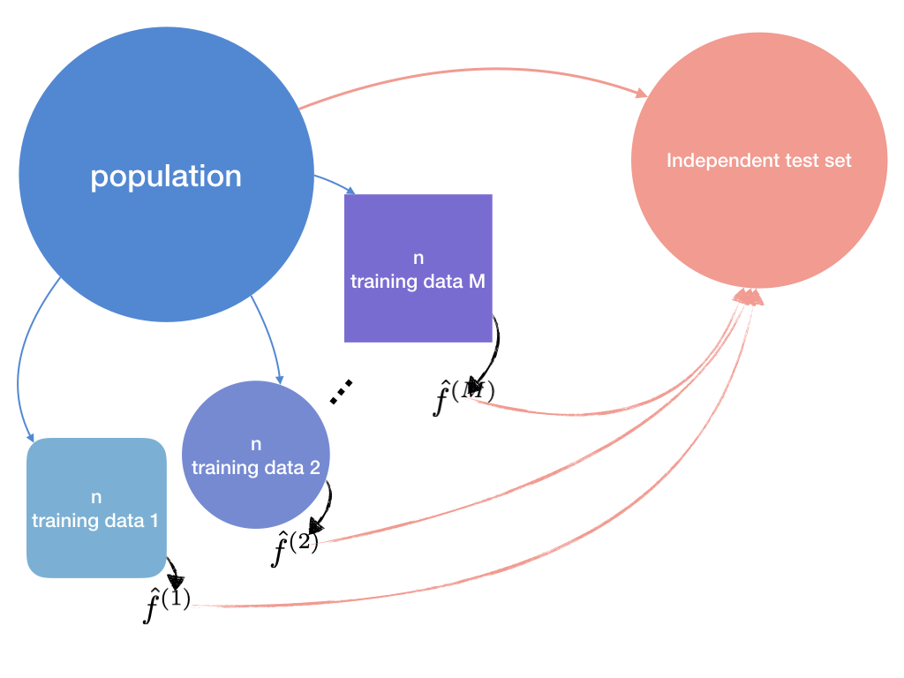

```{r setup, include=FALSE}
knitr::opts_chunk$set(
  comment = "#>",
  collapse = TRUE,
  out.width = "70%",
  fig.align = "center",
  fig.width = 6,
  fig.asp = .618,
  fig.pos = "H"
  )
knitr::knit_hooks$set(
  document = function(x) {
    sub("\\usepackage[]{color}", "\\usepackage{xcolor}", x, fixed = TRUE)
  }
)
options(digits = 3)
options(kableExtra.latex.load_packages = FALSE)
pander::panderOptions("digits", 3)
is_latex <- knitr::opts_knit$get("rmarkdown.pandoc.to") == "latex"
is_beamer <- knitr::opts_knit$get("rmarkdown.pandoc.to") == "beamer"
```

```{r, message=FALSE, echo=FALSE}
# tidyverse family---------------------
library(tidyverse)
# large data--------------------------
library(data.table)
# parallel replication----------------
library(foreach)
# custom packages----------------------
library(rmdtool) # devtools::install_github("ygeunkim/rmdtool")
library(goodgraphic) # devtools::install_github("ygeunkim/goodgraphic")
# set seed for report -----------------
set.seed(1)
```

```{r, message=FALSE, echo=FALSE}
# devtools::install_github("ygeunkim/ceshat")
library(ceshat)
# devtools::install_github("ygeunkim/youngtool")
library(youngtool)
# GARCH
library(rugarch)
```

## Reviewed Paper

```{r, include=FALSE, message=FALSE, warning=FALSE}
library(RefManageR)
bib <- ReadBib("../docs/nonparam.bib")
Citet(bib, "cai:2008aa")
```

```{r, echo=FALSE, results='asis'}
PrintBibliography(bib)
```

### Keywords

> Boundary effects, Empirical likelihood, Expected shortfall, Local linear estimation, Nonparametric smoothing, Value-at-risk, Weighted double kernel

# Risk Measures

## Value at Risk

Given time horizon,

```{r, echo=FALSE, fig.cap="Loss Distribution - Can the financial institution still be in business after a catastrophic event?"}
tibble(
  x = seq(-3, 3, by = .01),
  y = dnorm(x),
  VaR = x >= qnorm(.05)
) %>% 
  ggplot(aes(x = x)) +
  geom_path(aes(y = y)) +
  geom_ribbon(aes(ymin = 0, ymax = y, fill = VaR), show.legend = FALSE, alpha = .7) +
  scale_fill_manual(values = c("TRUE" = gg_hcl(1), "FALSE" = NA)) +
  theme_minimal() +
  theme(
    text = element_blank(),
    axis.ticks = element_blank()
  )
```

## Two Viewpoints

@Tsay:2010aa says that

- Financial institution: Maximal loss of a financial position during a given time period for a given probability
    - Measure of loss under *normal* market conditions
- Regulatory committe: Minimal loss under *extraordinary* market circumstances

## Definition

- $p$: **Right** tail probability
- $l$: Time horizon
- $L(l)$: loss function of the asset from $t$ to $t + l$
- $F_l$: CDF of $L(l)$

$$p = P \left[ L(l) \ge VaR \right]$$

i.e. VaR can be computed by finding the $p$-th quantile.

## Quantile Loss

```{r, echo=FALSE, fig.cap="CDF of Loss"}
tibble(
  x = seq(-3, 3, length.out = 1001),
  y = pnorm(x),
  quant = y >= .05
) %>% 
  ggplot(aes(x, y, colour = quant)) +
  geom_line(show.legend = FALSE) +
  scale_colour_manual(values = c("TRUE" = gg_hcl(1), "FALSE" = "black")) +
  scale_y_continuous(breaks = c(0, .05, 1)) +
  theme_minimal() +
  theme(
    axis.text.x = element_blank(),
    axis.title = element_blank()
  )
```

$$VaR = \inf \left\{ x \mathpunct{:} F_l(x) \ge 1 - p \right\}$$

## Loss function and log Returns

Consider dollar $\{ P_t \}$.

$$L(l) = P_{t + l} - P_t = R_{t + l} + \ldots + R_{t + 1}$$

where $R_t = P_t - P_{t - 1}$ is the return series.

- Loss occurs when the return $R_t$ are *negative*
- Use *negative returns*

## log Returns

### Taylor expansion

For any $x_0 > 0$,

$$\ln x \approx \ln x_0 + \frac{1}{x_0}(x - x_0)$$

Write $x = x_2$, $x_0 = x_1$. Then

$$\ln \frac{x_2}{x_1} \approx \frac{x_2}{x_1} - 1 = \frac{x_2 - x_1}{x_1}$$

### Percentage change

- Log returns $Y_t = \ln R_t$ correspond *approximately to percentage changes*
- Use *negative log returns*
- VaR by **Upper quantile of the distribution of log return**

## VaR using log Return

### log return

@cai:2008aa used the following value in a real example part.

$$-100 Y_{t + 1} = -100 \ln \frac{P_{t + 1}}{P_t} \approx \text{percentage loss}$$

### Dollar amount of VaR

From $t$ to $t + 1$,

$$VaR = P_t \times VaR(-100 Y_{t + 1})$$

## Subadditivity

- When two portfolios are merged, the risk measure should not be greater than the sum of each.
- VaR *underestimates* the actual loss.
- Thus, Expected shortfall

## VaR and Expected Loss

- VaR: Quantile loss of the loss distribution
- ES: Expected value of loss function if the *VaR is exceeded*

$$ES \defn E \left[ L(l) \mid L(l) \ge VaR \right]$$

## Conditional information

- $\{ X_t \mathpunct{:} t = 1, \ldots n \}$
- Exogenous variable: economic, market variables
- or *past observed returns* e.g. $\{ Y_{t - 1} \}$

## Conditional VaR

- Stationary log-return $\{ Y_t \mathpunct{:} t = 1, \ldots n \}$
- Conditional information $\{ X_t \mathpunct{:} t = 1, \ldots n \}$
- Conditional VaR (CVaR)

$$\nu_p(x) = S^{-1}(p \mid x)$$

where

- $S (y \mid x) \defn 1 - F(y \mid x)$
- $F$: conditional CDF of $Y_t$ given $X_t = x$.

## Conditional Expected Shortfall

\begin{equation*}
  \begin{split}
    \mu_p(x) & = E \left[ Y_t \mid Y_t \ge \nu_p(x), \color{red}{X_t = x} \right] \\
    & = \frac{1}{P\left( Y_t \ge \nu_p(x) \mid X_t = x \right)} \int_{\nu_p(x)}^\infty y f(y \mid x) dy \\
    & = \frac{1}{p} \int_{\nu_p(x)}^\infty y f(y \mid x) dy
  \end{split}
\end{equation*}

# Nonparametric Estimation

## Goal

### Risk measures

- CVaR: $\hat\nu_p(x)$
- CES: $\hat\mu_p(x)$

## Workflow of Estimation

### Plugging-in Method

$$\hat\mu_p(x) = \frac{1}{p} \int_{\hat\nu_p(x)}^\infty y \hat{f}(y \mid x) dy$$

### What to estimate

- Conditional PDF: $\hat{f}(y \mid x)$
- CVaR: $\hat\nu_p(x) = \hat{S}^{-1}(p \mid x)$ by inverting the conditional CDF

## Weighted Double Kernel Local Linear

# Simulation

## AR(1)-GARCH(1, 0)

```{r, include=FALSE}
ar0 <- .01
ar1 <- .62
omega <- .15
alp <- 0
bet <- .65
```


$$
\begin{cases}
  X_t = Y_{t - 1} \\
  Y_t = `r ar0` + `r ar1` X_t + \sigma_t \epsilon_t \\
  \sigma_t^2 = `r omega` + `r bet` \sigma_{t - 1}^2 \\
  \epsilon_t \sim N(0, 1)
\end{cases}
$$


## True conditional distribution

Since $\epsilon_t \sim N(0, 1)$,

$$\sigma_t \epsilon_t \sim N(0, \sigma_t^2)$$

$$Y_t \mid X_t \sim N \left( `r ar0` + `r ar1` X_t, \sigma_t^2 \right)$$

## True CES

- For each $X_t$, `pnorm(x, mean, sd)` gives the conditional cdf value.
- Inverting $S(y \mid x) = 1 - F(y \mid x)$ gives $\nu_p(x)$.

$$\nu_p(x) = S^{-1}(p \mid x)$$

- Plugging-in method gives $\mu_p(x)$.

$$\mu_p(x) = \frac{1}{p} \int_{\nu_p(x)}^\infty y f(y \mid x) dy$$

## Goal of MC Simulation

- Compute the error between the true $\mu_p(x)$ and $\hat\mu_p(x)$
- Is the estimator of @cai:2008aa good?

## Process

Monte Carlo Samples:

1. For fixed $x_t$ (pre-determined grid points)
2. Generate GARCH(1, 0): $(\sigma_t, \epsilon_t)$
3. Generate $Y_t$ using AR(1) for each $X_t = Y_{t - 1}$
4. AR(1): $Y_t = 0.01 + 0.62 Y_{t - 1} + \sigma_t \epsilon_t$

```{r, include=FALSE}
arch <- 
  ugarchspec(
    fixed.pars = c("omega" = omega, "alpha1" = alp, "beta1" = bet),
    mean.model = list(armaOrder = c(0, 0), include.mean = FALSE)
  )
```

## Expected Prediction Error

```{r, echo=FALSE, fig.cap="Simulating Expected prediction error"}

```


## Monte Carlo Samples

```{r, include=FALSE}
N <- 100
M <- 20
xcond <- seq_len(N) / (2 * N)
mc <- 
  lapply(
    1:M,
    function(i) {
      X <- ugarchpath(arch, n.sim = N)@path
      X <- do.call("cbind", X)[,-3]
      colnames(X) <- c("sigma", "garch")
      X %>% 
        data.table() %>% 
        .[,
          mc := paste0("s", i)]
    }
  ) %>% 
  rbindlist() %>% 
  .[,
    xt := xcond,
    by = mc] %>% 
  .[,
    yt := ar0 + ar1 * xt + garch]
```


```{r, echo=FALSE}
mc[]
```

## Numerical Results

```{r, echo=FALSE}
sig <- unique(mc$sigma)
mc %>% 
  .[,
    true_ces := plugin_ces(
      pdf = function(y, x) dnorm(y, mean = ar0 + ar1 * x, sd = sig),
      cdf = function(y, x) pnorm(y, mean = ar0 + ar1 * x, sd = sig),
      x = xt,
      lower = -1,
      upper = 1
    )] %>% 
  .[,
    true_cvar := invert_cvar(
      cdf = function(y, x) pnorm(y, mean = ar0 + ar1 * x, sd = sig),
      x = xt
    )]
#---------------------------
N0 <- 200
x <- ugarchpath(arch, n.sim = N0)@path
x <- do.call("cbind", x)[, -3]
colnames(x) <- c("sigma", "garch")
mc_test <- 
  x %>% 
  data.table() %>% 
  .[,
    xt := seq_len(N0) / (2 * N0) + .5] %>% 
  .[,
    yt := ar0 + ar1 * xt + garch] %>% 
  .[,
    true_ces := plugin_ces(
      pdf = function(y, x) dnorm(y, mean = ar0 + ar1 * x, sd = sig),
      cdf = function(y, x) pnorm(y, mean = ar0 + ar1 * x, sd = sig),
      x = xt,
      lower = -1,
      upper = 1
    )] %>% 
  .[,
    true_cvar := invert_cvar(
      cdf = function(y, x) pnorm(y, mean = ar0 + ar1 * x, sd = sig),
      x = xt
    )]
```


```{r, include=FALSE}
test_err <- function(band) {
  mc %>% 
    .[,
      .(pred = wdkll_ces(yt ~ xt, data = .SD, nw_h = band, h0 = band / 10) %>% 
          predict(mc_test$xt),
        ces = mc_test$true_ces),
      by = mc] %>% 
    .[,
      abs_err := abs(ces - pred)] %>% 
    .[,
      .(abs_err = mean(abs_err)),
      by = mc]
}
```


```{r, include=FALSE, cache=TRUE}
cl <- parallel::makeCluster(3)
doParallel::registerDoParallel(cl, cores = 3)
parallel::clusterEvalQ(cl, c(library(data.table), library(magrittr), library(ceshat)))
#--------------------------------
err_tab <- 
  foreach(h = c(.5, 1, 5), .combine = cbind, .inorder = FALSE) %dopar% {
    test_err(band = h)[, abs_err]
  }
#--------------------------------
parallel::stopCluster(cl)
```

```{r, echo=FALSE}
err_tab %>% 
  as.data.frame() %>% 
  mutate(mc = paste0("s", 1:n())) %>% 
  pivot_longer(
    -mc, 
    names_to = "bandwidth",
    names_pattern = "result\\.?(.)"
  ) %>% 
  mutate(
    bandwidth = parse_integer(bandwidth)
  ) %>% 
  ggplot(aes(x = bandwidth, y = value, group = bandwidth)) +
  geom_boxplot()
```


# Data Analysis

## Bitcoin

<!-- ```{r, message=FALSE, echo=FALSE} -->
<!-- dji <- -->
<!--   read_csv("../data/dji.csv") %>% -->
<!--   select(Date, price = Close) -->
<!-- ``` -->

<!-- ```{r, include=FALSE} -->
<!-- dji_return <-  -->
<!--   dji %>%  -->
<!--   mutate( -->
<!--     yt = -log(price / dplyr::lag(price)) * 100, -->
<!--     xt = dplyr::lag(yt) -->
<!--   ) %>%  -->
<!--   dplyr::filter( -->
<!--     Date >= "1998-11-03", -->
<!--     Date <= "2006-01-03" -->
<!--   ) -->
<!-- ``` -->

<!-- ```{r, echo=FALSE} -->
<!-- dji_return %>% -->
<!--   ggplot(aes(x = Date, y = yt)) + -->
<!--   geom_line() + -->
<!--   scale_x_date() + -->
<!--   ylab("Daily return") + -->
<!--   theme_minimal() -->
<!-- ``` -->

<!-- ```{r, message=FALSE, echo=FALSE} -->
<!-- nflx <- -->
<!--   read_csv("../data/NFLX.csv") %>% -->
<!--   select(Date, price = Close) -->
<!-- ``` -->

<!-- ```{r, echo=FALSE} -->
<!-- nflx %>%  -->
<!--   ggplot(aes(Date, price)) + -->
<!--   geom_line() + -->
<!--   scale_x_date() + -->
<!--   ylab("Price") + -->
<!--   theme_minimal() -->
<!-- ``` -->


```{r, message=FALSE, echo=FALSE}
coin <-
  read_csv("../data/btc.csv") %>%
  select(Date, price = `24h Open (USD)`)
```

```{r, echo=FALSE, fig.cap="Bitcoin price in USD", cache=TRUE}
coin %>% 
  ggplot(aes(Date, price)) +
  geom_line() +
  scale_x_date() +
  ylab("Price") +
  theme_minimal()
```

## Daily Return

As mentioned, @cai:2008aa used daily return defined by $y_t \defn - 100 \ln \frac{P_t}{P_{t - 1}}$

<!-- ```{r, echo=FALSE} -->
<!-- nflx_return <-  -->
<!--   nflx %>%  -->
<!--   mutate( -->
<!--     yt = -log(price / dplyr::lag(price)) * 100, -->
<!--     xt = dplyr::lag(yt) -->
<!--   ) %>%  -->
<!--   dplyr::filter( -->
<!--     Date >= "2018-12-01", -->
<!--     Date < "2019-12-01" -->
<!--   ) -->
<!-- ``` -->

<!-- ```{r, echo=FALSE} -->
<!-- nflx_return %>% -->
<!--   ggplot(aes(x = Date, y = yt)) + -->
<!--   geom_line() + -->
<!--   scale_x_date() + -->
<!--   ylab("Daily return") + -->
<!--   theme_minimal() -->
<!-- ``` -->

```{r, echo=FALSE}
coin_return <- 
  coin %>% 
  mutate(
    yt = -log(price / dplyr::lag(price)) * 100,
    xt = dplyr::lag(yt)
  ) %>% 
  dplyr::filter(
    Date >= "2018-06-01",
    Date < "2019-12-01"
  )
```

```{r, echo=FALSE, fig.cap="Daily return of bitcoin price"}
coin_return %>%
  ggplot(aes(x = Date, y = yt)) +
  geom_line() +
  scale_x_date() +
  ylab("Daily return") +
  theme_minimal()
```

## CES for DJI

<!-- ```{r, echo=FALSE} -->
<!-- nflx_ces <- wdkll_ces(yt ~ xt, data = nflx_return, nw_h = 1, h0 = .1, lower_invert = -5, upper_invert = 5) -->
<!-- ``` -->

<!-- ```{r, echo=FALSE, cache=TRUE} -->
<!-- tibble(x = seq(-1.5, 1.5, by = .1)) %>%  -->
<!--   mutate(CES = predict(nflx_ces, x)) %>%  -->
<!--   ggplot(aes(x, CES)) + -->
<!--   geom_point() + -->
<!--   theme_minimal() -->
<!-- ``` -->

```{r, echo=FALSE}
coin_ces <- wdkll_ces(yt ~ xt, data = coin_return, nw_h = 1, h0 = .1, lower_invert = -5, upper_invert = 5)
```

```{r, echo=FALSE, cache=TRUE, fig.cap="Conditional Expected Shortfall given each lagged variable value"}
coin_pred <- 
  tibble(x = seq(-1.5, 1.5, by = .1)) %>% 
  mutate(CES = predict(coin_ces, x))
#----------------------------------------
(smile <- 
  coin_pred %>% 
  ggplot(aes(x, CES)) +
  geom_path() +
  theme_minimal())
```

- Volatility smile
- Conditional information `x`: positive $y_{t - 1}$ means loss

## Interpretation

Following @cai:2008aa,

- Risk tends to be lower when *lagged log loss* is close to the emprirical average,
- and larger otherwise
- Bitcoin price is more likely to fall *if there were a loss* within the last day than if there was a same amount of positive return.

```{r, echo=FALSE, cache=TRUE, out.width="50%"}
ymin <- coin_pred %>% summarise(min(CES)) %>% pull()
ymax <- coin_pred %>% summarise(max(CES)) %>% pull()
y1neg <- coin_pred %>% filter(x == -1) %>% select(CES) %>% pull()
y1 <- coin_pred %>% filter(x == 1) %>% select(CES) %>% pull()
#---------------------------------------------------
smile +
  annotate("segment", x = 0, xend = 1.5, y = .5, yend = ymax - .1, arrow = arrow(length = unit(.03, "npc")), col = gg_hcl(1)) +
  annotate("text", x = .5, y = .6, label = "price more likely to fall if loss", col = "red") +
  annotate("segment", x = -1, xend = -1, y = ymin, yend = y1neg, col = gg_hcl(2)[2]) +
  annotate("segment", x = 1, xend = 1, y = ymin, yend = y1, col = gg_hcl(2)[2]) +
  annotate("segment", x = -1, xend = -1.5, y = y1neg, yend = y1neg, col = gg_hcl(2)[2]) +
  annotate("segment", x = 1, xend = -1.5, y = y1, yend = y1, col = gg_hcl(2)[2])
```


## References


